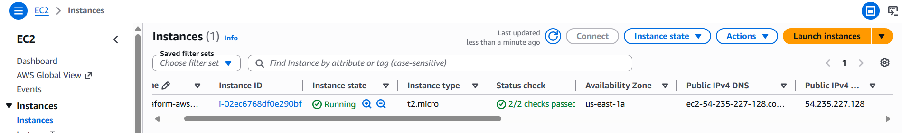
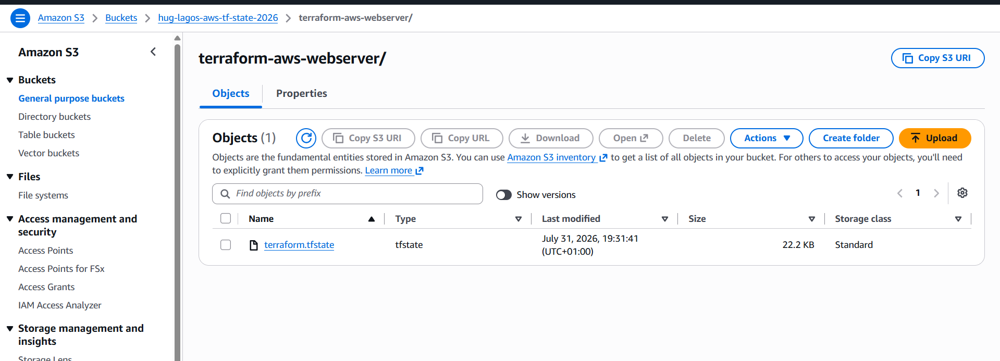

# AWS Infrastructure Provisioning with Terraform

Provision a modular AWS web server environment on Amazon Web Services using Terraform, Infrastructure as Code (IaC), reusable Terraform modules, automated EC2 bootstrapping with NGINX, and remote Terraform state management.

---

## 📖 Overview

This project provisions a complete AWS web server environment on Amazon Web Services using Terraform.

The infrastructure is organized into reusable Terraform modules that separate networking, security, compute, and backend resources into independent components, improving maintainability, scalability, and reusability.

To support collaborative Infrastructure as Code workflows, Terraform state is managed remotely using an Amazon S3 backend with native Terraform state locking.

The backend infrastructure is provisioned through a dedicated **bootstrap-backend** configuration before the main infrastructure is initialized, following a common production pattern for Terraform projects.

An EC2 `user_data` bootstrap script automatically installs and configures NGINX during provisioning, allowing the web server to become operational immediately after deployment.

---

## ✨ Features

- Modular Terraform architecture
- Reusable Infrastructure as Code (IaC) modules
- Automated EC2 provisioning
- Automated NGINX installation using `user_data`
- Remote Terraform state stored in Amazon S3
- Native Terraform state locking (`use_lockfile`)
- Repeatable infrastructure deployments
- Clean separation of infrastructure components

---

## 🏗️ Architecture

```text
                   Internet
                       │
               Internet Gateway
                       │
                 Route Table
                       │
                 Public Subnet
                       │
              Security Group
           (SSH 22 | HTTP 80)
                       │
          Ubuntu EC2 Instance
                       │
             user_data Bootstrap
                       │
               NGINX Web Server
                       │
             Custom HTML Landing Page
```

---

## ☁️ Infrastructure Components

This project provisions the following AWS resources:

- Amazon VPC
- Public Subnet
- Internet Gateway
- Route Table
- Route Table Association
- Security Group
- Ubuntu EC2 Instance
- NGINX Web Server
- Amazon S3 Backend for Terraform State

---

## 📦 Terraform Modules

| Module | Responsibility |
|----------|----------------|
| **bootstrap-backend** | Provisions the Amazon S3 remote backend |
| **vpc** | Creates the Virtual Private Cloud |
| **networking** | Creates the Public Subnet, Internet Gateway, Route Table and Association |
| **security-group** | Configures SSH and HTTP access |
| **compute** | Deploys the EC2 instance and bootstraps NGINX |

---

## 📂 Project Structure

```text
terraform-aws-webserver/
│
├── bootstrap-backend/
│   ├── main.tf
│   ├── outputs.tf
│   ├── providers.tf
│   ├── variables.tf
│   └── terraform.tfvars
│
├── modules/
│   ├── compute/
│   ├── networking/
│   ├── security-group/
│   └── vpc/
│
├── backend.tf
├── main.tf
├── outputs.tf
├── providers.tf
├── variables.tf
├── terraform.tfvars.example
├── README.md
└── images/
```

---

## 🔐 Remote State Management

Terraform state is managed remotely using an Amazon S3 backend.

The backend infrastructure is provisioned using the **bootstrap-backend** Terraform configuration before the application infrastructure is initialized, following a common production pattern used in Infrastructure as Code projects.

Backend features include:

- Amazon S3 Backend
- Bucket Versioning
- Server-side Encryption
- Native Terraform State Locking (`use_lockfile = true`)

---

## ⚙️ Prerequisites

Before deploying this project, ensure you have:

- Terraform v1.6+
- AWS CLI
- AWS Account
- Configured AWS Credentials
- Existing EC2 Key Pair

---

## 🚀 Deployment

Clone the repository:

```bash
git clone https://github.com/Ajotony/terraform-aws-webserver.git
cd terraform-aws-webserver
```

### Bootstrap the Remote Backend

```bash
cd bootstrap-backend

terraform init

terraform apply

cd ..
```

### Deploy the Infrastructure

```bash
terraform init

terraform fmt -recursive

terraform validate

terraform plan

terraform apply
```

Destroy the infrastructure when no longer needed:

```bash
terraform destroy
```

---

## 🌐 Access the Application

After deployment, Terraform outputs the EC2 public IP.

Open your browser and navigate to:

```text
http://<EC2_PUBLIC_IP>
```

---

## 📸 Screenshots

### AWS EC2 Instance

Terraform successfully provisioned the Ubuntu EC2 instance.

<p align="center">
  
</p>

---

### NGINX Web Server

NGINX automatically installed and configured using EC2 `user_data`.

<p align="center">
  
</p>

---

### Remote Terraform Backend

Terraform state stored remotely in Amazon S3.

<p align="center">
  
</p>

---

## 🛠️ Technologies Used

- Terraform
- Amazon Web Services (AWS)
- Amazon EC2
- Amazon VPC
- Amazon S3
- Ubuntu Server
- NGINX
- Git
- GitHub

---

## 💡 Key Concepts Demonstrated

- Infrastructure as Code (IaC)
- Modular Terraform Architecture
- Terraform Modules
- Remote State Management
- Amazon S3 Backend
- Native Terraform State Locking
- Infrastructure Automation
- AWS Networking
- EC2 Provisioning
- Resource Dependencies
- Automated EC2 Bootstrapping

---

## 📚 Key Takeaways

- Designed reusable Terraform modules for infrastructure provisioning.
- Automated AWS infrastructure deployment using Infrastructure as Code.
- Implemented automated server configuration using EC2 `user_data`.
- Configured a remote Terraform backend using Amazon S3.
- Improved infrastructure maintainability through modular architecture.

---

## 👨‍💻 Author

**Anthony Ajibola-Ajo**

- GitHub: https://github.com/Ajotony
- LinkedIn: https://linkedin.com/in/anthony-ajibola-ajo

---

## Acknowledgements

This project was developed as part of the **HUG Lagos/Ibadan 30-Day Terraform Challenge**, applying Infrastructure as Code principles and Terraform best practices to build modular, maintainable AWS infrastructure.